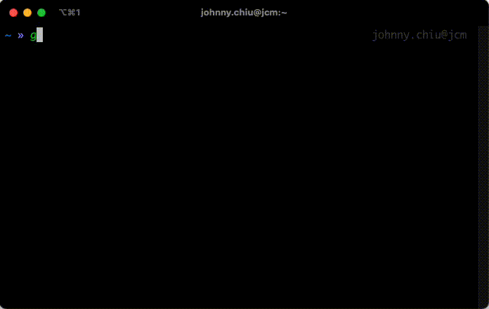
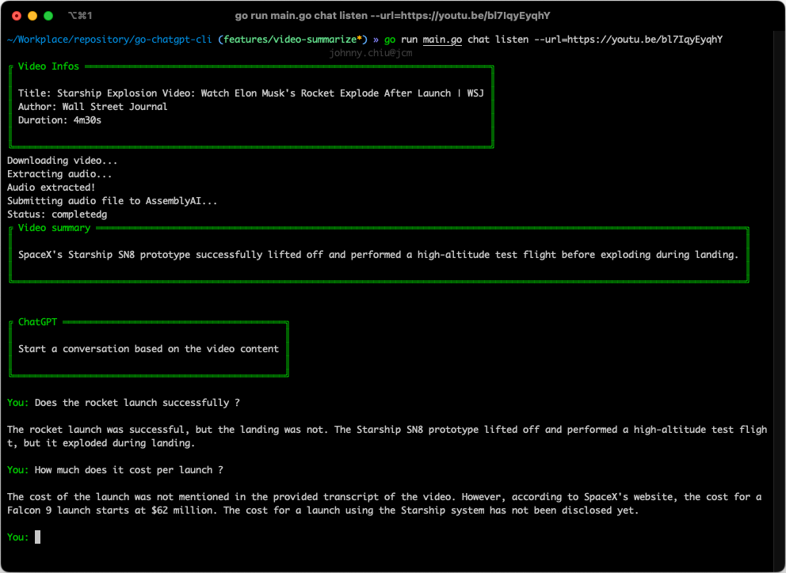

<p align="center">


<h4>Chat with ChatGPT in terminal</h4>

<h4>ChatGPT to summarize a youtube video</h4>

# What is this?
A client implementation for chatGPT using openAI api and go. This is a project built for fun and to learn more about go.


# Features
- CLI interface for chatGPT
  - Start conversation with chatGPT
  - Resume conversation with chatGPT
  - Save conversation to file
- Summarize youtube video
  - Chat with chatCPT about the video
  
# Commands
- `chat` - Start a new conversation 
- `chat resume --id=xxx` - Resume a conversation 
- `chat history` - View conversation history
- `chat listen --url=https://youtu.be/dQw4w9WgXcQ` - Give a summary of the video, chat with chatGPT about the video
- `config --api_key={apiKey} --model={Model}` - Configure Apikey and Language Model

You can also use `--help` to view the help menu for each command.

# Getting Started

## Prerequisites
- [Go](https://golang.org/doc/install)
- [OpenAI Api Key](https://beta.openai.com/docs/developer-quickstart/your-api-keys)
- [Ffmpeg](https://ffmpeg.org/download.html) (Optional)
- [AssemblyAI Api Key](https://app.assemblyai.com/login) (Optional)

## Usage
1. Clone the repo
```sh
git clone https://github.com/pang0103/go-chatgpt-cli
```
2. Build the project
```sh
go build -o gpt-cli
```
3. Configurate the api key
```sh
./gpt-cli config --api_key={apiKey}
```
4. Have fun
```sh
./gpt-cli chat
```

# Contributing
Contributions are what make the open source community such an amazing place to be learn, inspire, and create. Any contributions you make are greatly appreciated.

# License
Distributed under the MIT License. See `LICENSE` for more information.


